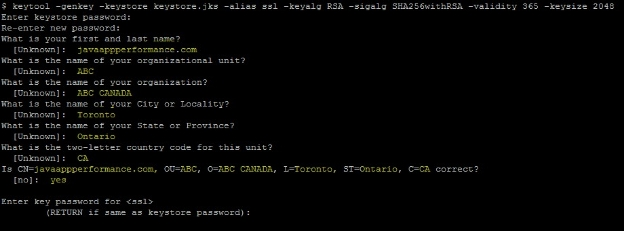
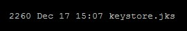
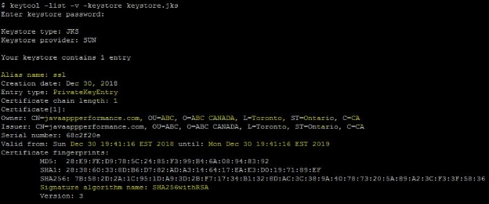
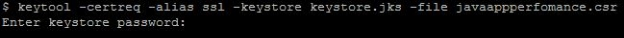
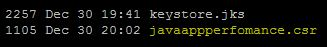

**Create a Keystore Using the Keytool**

While we create a Java keystore, we will first create the .jks file that will initially only contain the private key using the keytool utility.

keytool -genkey -keystore keystore.jks -alias ssl -keyalg RSA -sigalg SHA256withRSA -validity 365 -keysize 2048

- ` `-alias is an option to mention an Alias Name for your key entry
- ` `-keyalg specifies the algorithm to be used to generate the key pair
- ` `-keysize specifies the size of each key to be generated
- ` `-sigalg specifies the algorithm that should be used to sign the self-signed certificate; this algorithm must be compatible with keyalg.
- ` `-validity specifies the validity of the keystore that you want to create.

When you execute the command, we will be prompted with a question we need to answer to add the key details, such as common name (website/application dns name), organization, country, state, province, country code, etc. These are user-defined values. Also, it will prompt you to enter keystore and key password, which should be used in the future to read/write/modify the keystore.

As the keystore name is mentioned, keystore.jks, while creating the keystore.jks file, will be created in the current folder.

Use the command below to list the entries in keystore to view the content. We will be able to see the entered values reflected on the private key entries on the keystore.jks file.

keytool -list -v -keystore keystore.jks

**Generate a CSR (Certificate Signing Request) From the Keystore**

The next step is to create a Certificate Signing Request (CSR) from the created keystore to share with the Certificate Authority (CA) to sign and generate the primary/server certificate.

keytool -certreq -alias ssl -keystore keystore.jks -file javaappperfomance.csr

We need to pass the correct alias name and password, which we mentioned during the creation of the keystore to extract the certificate request.

**Generate a Signed Primary/Server Certificate From the Certificate Authority**

Submit the generated CSR to any of the CA, which is supported by the SSL community to get the signed the Primary/Server certificate. The CA will be selected based on the organizations or your personnel selection.

Here is a list of the top ten Certificate Authorities in the world (according to Wikipedia):

|Rank|Issuer|
| :- | :- |
|1|Comodo|
|2|IdenTrust|
|3|Symantec|
|4|GoDaddy|
|5|GlobalSign|
|6|DigiCert|
|7|Certum|
|8|Entrust|
|9|Secom|
|10|Actalis|

**Import the Primary/Server Certificate, Root, and Intermediate CA Certificates to Keystore**

Once the CA signed the certificate and share it with us, we need to import the certificate to the keystore for the private key entry we created.

The following keytool commands can be used to import the signed certificate to keystore; we should use the alias name that is the same as the alias name on the private key entry.

keytool -import -alias ssl -keystore keystore.jks -file javaappperfomance.crt

keytool -import -trustcacerts -alias ssl -file javaappperfomance.crt -keystore keystore.jks

The second one is optional using  -trustcacerts.

If the -trustcacerts option has been specified, additional certificates are considered for the chain of trust, namely the certificates in a file named "cacerts."

If the alias does not point to a key entry, then keytool assumes you are adding a trusted certificate entry. In this case, the alias should not already exist in the keystore. If the alias does already exist, then keytool outputs an error since there is already a trusted certificate for that alias and does not import the certificate.

If the alias points to a key entry, then keytool assumes you are importing a certificate reply.

The old chain can only be replaced if it is a valid keypass, the password used to protect the private key of the entry is supplied. If no password is provided, and the private key password is different from the keystore password, the user will be prompted for it.

**Import a Root or Intermediate CA Certificate to an Existing Java Keystore**

keytool -import -trustcacerts -alias root -file entrust.cer -keystore keystore.jks

Entrust(CA) is used as an example, File will be different and supplied by the Certificate Authority(CA) based on your CA.

To View/List the certificate we have added below command can be used

keytool -list -v -keystore keystore.jks

**Share the Certificate or Root Certificates to the System** 

Next, you need to share the certificate or root certificates to systemwhich use the SSL to communicate to your system/application.

As you have created a new private/public key for your DNS name, we need to share the certificate with any of the interfacing applications (Not Browser as it will be having CA root/intermediate on its list).

**Important commands for keytool**

These commands can be used while we create, import, export, delete, and/or change certificate in a keystore.

First, generate a Java keystore and key pair:

keytool -genkey -alias aliasname -keyalg RSA -keystore keystore.jks -keysize 2048

Then, generate a certificate signing request (CSR) for an existing Java keystore:

keytool -certreq -alias aliasname -keystore keystore.jks -file domainname.csr

Next, generate a keystore and self-signed certificate:

keytool -genkey -keyalg RSA -alias selfsigned -keystore keystore.jks -storepass password -validity 360 -keysize 2048

You can view or list the certificate; the command below can be used:

` `keytool -list -v -keystore keystore.jks

Import a root or intermediate CA certificate to an existing Java keystore:

keytool -import -trustcacerts -alias root -file domainname.crt -keystore keystore.jks

Delete a certificate from a Java keytool keystore:

keytool -delete -alias aliasname -keystore keystore.jks

Next, change a Java keystore password:

keytool -storepasswd -new new\_storepass -keystore keystore.jks

Lastly, export a certificate from a keystore:

keytool -export -alias aliasname -file filename.crt -keystore keystore.jks

That's all for now. Hope you learned more about using the Java keytool command.

