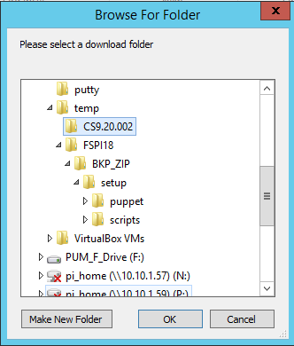
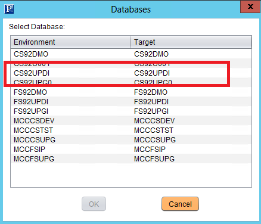
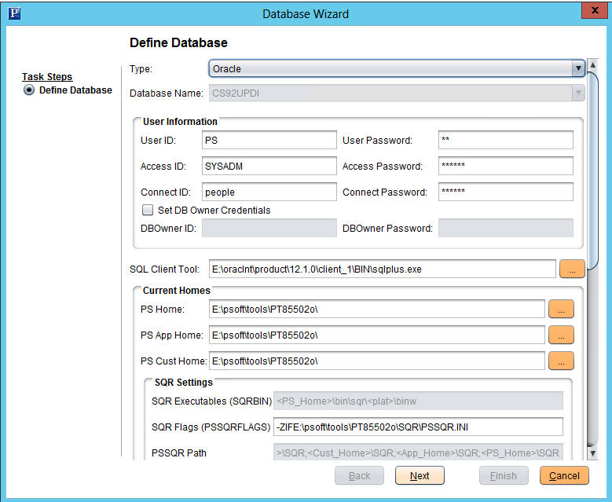
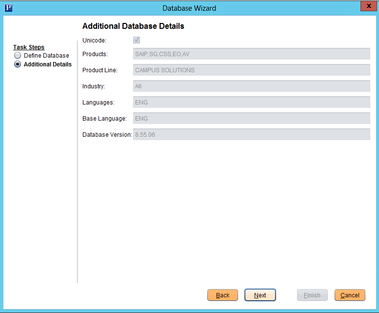
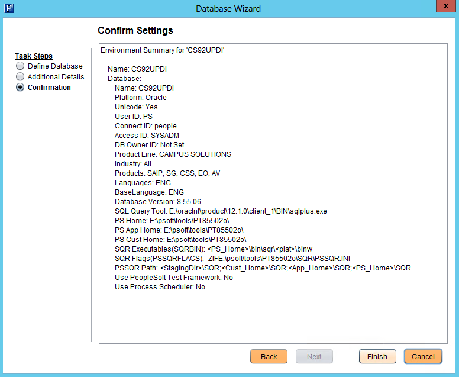

||**IP** |**Host Name**|**PI Home**|
| :- | :- | :- | :- |
|PUM Server|10\.10.1.56|Usny01OPUM001|
CS (10.10.1.57) – N:

FS (10.10.1.59) – P:
|
|CS – CA Server|10\.10.13.47|MCC04W32I001|
Image 1 - E:\psoft\CS92\_pi\_home

Image 2 - E:\psoft\pi\_home\_cs920.002
|
|FS – CA Server|10\.10.13.66|MCC04W32I002|E:\psoft\pi\_home\|

1. Download the Image file from My Oracle Support to the PUM server (10.10.1.56)

`                   `

`                    `

`                    `

`                   `

`                `

1. Select Download All option and download the files to c:\temp\<download folder>, i.e., e:\temp\cs9.20.002 folder.

`               `

`              `

`              `

1. Unzip the first zip file CS-920-UPD-002-OVA\_1of15.zip file in the <download folder>

`               `

1. Open PowerShell, and navigate to E:\temp\CS9.20.002\setup. In case you do not have permissions to run PowerShell scripts, run the following command: ***Set-executionpolicy remotesigned***

`                `

|
Windows PowerShell

Copyright (C) 2013 Microsoft Corporation. All rights reserved.

PS C:\Users\Administrator> **e:**

PS E:\> **cd temp\cs9.20.002\setup**

PS E:\temp\cs9.20.002\setup> **dir**

`    `Directory: E:\temp\cs9.20.002\setup

Mode                LastWriteTime     Length Name

----                -------------     ------ ----

d----          5/3/2016  10:24 AM            puppet

d----         7/27/2016  12:28 PM            scripts

-----         5/20/2016   7:11 PM         47 bs-manifest

-----         5/20/2016   7:11 PM      31759 psft-dpk-setup.ps1

-----         5/20/2016   7:11 PM      24169 psft-dpk-setup.sh

PS E:\temp\cs9.20.002\setup> **.\psft-dpk-setup.ps1**

Starting the PeopleSoft Environment Setup Process:

Extracting the Zip File CS-920-UPD-002-OVA\_10of15.zip:      [  OK  ]

Extracting the Zip File CS-920-UPD-002-OVA\_11of15.zip:      [  OK  ]

Extracting the Zip File CS-920-UPD-002-OVA\_12of15.zip:      [  OK  ]

Extracting the Zip File CS-920-UPD-002-OVA\_13of15.zip:      [  OK  ]

Extracting the Zip File CS-920-UPD-002-OVA\_14of15.zip:      [  OK  ]

Extracting the Zip File CS-920-UPD-002-OVA\_15of15.zip:      [  OK  ]

Extracting the Zip File CS-920-UPD-002-OVA\_1of15.zip:       [  OK  ]

Extracting the Zip File CS-920-UPD-002-OVA\_2of15.zip:       [  OK  ]

Extracting the Zip File CS-920-UPD-002-OVA\_3of15.zip:       [  OK  ]

Extracting the Zip File CS-920-UPD-002-OVA\_4of15.zip:       [  OK  ]

Extracting the Zip File CS-920-UPD-002-OVA\_5of15.zip:       [  OK  ]

Extracting the Zip File CS-920-UPD-002-OVA\_6of15.zip:       [  OK  ]

Extracting the Zip File CS-920-UPD-002-OVA\_7of15.zip:       [  OK  ]

Extracting the Zip File CS-920-UPD-002-OVA\_8of15.zip:       [  OK  ]

Extracting the Zip File CS-920-UPD-002-OVA\_9of15.zip:       [  OK  ]

Found PeopleSoft SES VMDK TGZ file parts in the DPK folder

E:\temp\cs9.20.002. If the VM is set up as a PeopleSoft Demo,

environment, we can automate the process of adding it to the VM.

Do you want to add the SES VMDK Disk to the VM? [Y|n]: **n**

Setting up the PeopleSoft Environment in VirtualBox:

Checking if VirtualBox Software is Installed on the Host:   [  OK  ]

Checking if VirtualBox Machine Folder has Enough Space:     [  OK  ]

Checking if VirtualBox Manager is Running on the Host:      [  OK  ]

Checking if PeopleSoft Appliance is Available to Import:    [  OK  ]

Found a PeopleSoft VirtualBox Appliance [VBOX\_8\_55\_06\_SHELL.ova]

in the DPK folder E:\temp\cs9.20.002. We can automate the process of

importing this appliance into VirtualBox if VirtualBox software is installed

on the Host.

Do you want to Import the PeopleSoft Appliance into VirtualBox? [Y|n]: **Y**

Checking if the PeopleSoft Appliance is already Imported:   [  OK  ]

Importing the PeopleSoft Appliance into VirtualBox:         [  OK  ]

The Network Adapter lets the VM be available either in a Sand-Box

mode or accessible to other hosts in the network.

1\. Host-Only Network Adapter

2\. Bridged Network Adapter

Enter 1 or 2: **2**

Setting up Bridged Network Adapter for the VM:              [  OK  ]

Setting up the Shared Folder E:\temp\cs9.20.002 on the VM:  [  OK  ]

Starting the VirtualBox Manager on the Host:                [  OK  ]

Starting the Imported PeopleSoft Appliance VM:              [  OK  ]

**The VirtualBox portion of the PeopleSoft environment setup is complete.**

**Access the auto launched VM to continue with the PeopleSoft environment**

**initialization process.**

PS E:\temp\cs9.20.002\setup>
|
| :- |

1. Virtual Box will automatically launch VM to continue with the PeopleSoft environment setup… 

`                `

`                  `

`                     `

`                     `

`                   `

`                    `

`                    `

`                   `

- Gateway

  |
[root@hitscs92updi ~]# route -n

Kernel IP routing table

Destination     Gateway         Genmask         Flags Metric Ref    Use Iface

0\.0.0.0         **10.10.1.1**       0.0.0.0         UG    0      0        0 eth0

10\.10.1.0       0.0.0.0         255.255.255.0   U     0      0        0 eth0

|
  | :- |

- DNS Server

  |
[root@hitscs92updi ~]# cat /etc/resolv.conf

;generated by /opt/oracle/psft/dpk/scripts/psft-setup.sh

**nameserver 10.10.1.50**

search hitscs.local

[root@hitscs92updi ~]# grep nameserver /etc/resolv.conf

**nameserver 10.10.1.50**

[root@hitscs92updi ~]#
|
  | :- |

1. The screenshot below shows when the image is successfully created.      

`               `

1. Open putty and connect to the new Image.      

`                `

`               `**CS – 10.10.1.57**

`               `**FS – 10.10.1.59**

`               `**HC – 10.10.1.61**

`                  `

`                  `

1. Run the following commands to start the EMAgent.

   |
Use the root account to connect to 10.10.1.57 or 10.10.1.59

**cd /opt/oracle/psft/pt/ps\_home8.55.06/PSEMAgent**

**chmod 777 -R envmetadata**

**su – psadm2**

**cd $PS\_HOME**

**cd PSEMA\*** 

**./StartAgent.sh**
|
   | :- |

1. Log in to your CA server, and verify connection to this new image. Go to Tools -> Options

`             ` 

`            ` 

1. Test Database connection. Go to File -> Open Database -> select **XX92UPDI**

   `  `

  

   Review configuration and correct any errors you may find. Click Next

`                    `/

`                      `Click Next

`                      `

`                     `Click Finish

`                     `

