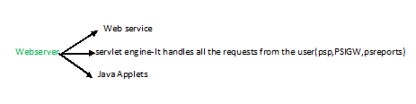

PeopleSoft Basics

Detail about PIA Architecture

PIA is comprised of a variety of components like DB Server, App server & Web server.

·         The App server & Web server can be installed on a single host machine or separate s/m.

·         In PIA the 2 servers must work very close together.

It includes: (1) web browser (2) web server (3) App server (4) Batch server (5) DB Server.

·         The webserver includes the PIA client, Report Repository server & Integration Gateway.

·         Web browser is used to send request to the webserver .

**Psreports:** It is a servlet which enables the user to easily access & distribute the bash reports.

**App server:** It is nothing but a set of server process which include BBL, Listeners, Handlers & queues.

**Batch server:** The server which runs batch process ex: process scheduler server

**DB Server:** It is used to store & manage the Data.     

**Flow:**

1\.       Web browser link interpreted as url address which includes:

[http://servername:httpportno/psp/domain name/](http://www.blogger.com/null) ?cmd=login

hostname=server name, httpportno, PeopleSoft portal servlet(psp)& Domain name

2\.       Servlet running in the servlet engine interprets request & comes up with a list of objects that are required to build a page.

3\.       Request of all required objects sent to application server in the form of a jolt message.

4\.       In App servers JSL listens the request & JSH will handle the request.

·         JREP is a process that is used to convert jolt messages into tuxedo messages.

Because BBL can understand only TUXEDO messages.

·         BBL (Bulletin Board Liaison) it handles client requests, listeners, handlers & queues

·         BBL will take request & route it to the appropriate PeopleSoft processes.

·         BBL will directs the communication traffic (It routes the requests which process is idle)

5\.       PeopleSoft process converts service requests into SQL statements.

6\.       SQL statements sent to DB

7\.       Data requested is supplied by the DB.

8\.       People Soft Process constructs html page out of object data.

9\.       Tuxedo acknowledges receipt of data & closes connection with the People Soft process.

10\.   Data forwarded by tuxedo to requesting Java Servlet on webserver.

11\.   Servlets forwards page requested by browser.

12\.   Browser views pages.

**EXPLANATION:**

` `WEB-BROWSERS: End users & even administrators access people soft applications & administrative tools by using web browser.

·         The browser uses the HTTP protocol to send requests to the web server which forwards the request to the application server.

·         A server installed on the webserver facilities all browser connections.

·         The App server sends only the following to the browser.

(a)    HTML (b) Java Script (c) Cookies

Note: Browser cookie is in memory cookie & is never written to the disk.

WEBSERVER: A java-enabled webserver is required to support browser transaction requests & the application messaging technology.

·         We install on the web server “A collection of people soft Java servlets designed to handle a wide range of People Soft Applications:

·         The web server must be java-enabled. So that it can run servlets.

·         During people soft installation, a variety of people soft java servlets are installed on the webserver.

` `WEB SERVICES:  The program installed on the host system that manages the webserver such as WebLogic or WebSphere.

- SERVLETS ENGINE: This env is used to run servlets.
- JAVA SERVLETS: A platform independent programming language used widely for web based programs.

PEOPLESOFT SERVLETS: servlets are java programs on the web server.

·         The following list contains the PeopleSoft servlets that reside on the webserver.

PORTAL SERVLET: It handles all the requests & users accessing people soft through the portal servlet.

·         It manages people soft portal such as search, content msgs & home page personalizations.

INTEGRATION GATEWAY SERVLET: This servlet transmits publish/subscribe messages between message nodes.

REPORT REPOSITORY SERVLET: It enables users to easily access & distribute to o/p of batch reports. Such as crystal,sqr(Reports will run by process scheduler)

·         This servlet retrieves the report 0/p in the report repository & servers it to the browser.

JOLT: (JAVA ONLINE TRANSACTION) The PS servlets on the web server transmit requests & data through a connection to JOLT. Which runs in App server.

BEA JOLT: The browsers do not connect directly to the App server. Instead they send HTTP requests to the page servlets running on the web browser that translates http requests into a JOLT reqest that is sent to a specified JOLT portno.

**APPLICATION SERVER**

It is core of PIA. It executes business logic & issues SQL to the DB Server. This consists of numerous PS services & server processes that handle transaction requests.

·         This server is responsible for maintaining the SQL connection to the DB for browser requests & windows development environment.

·         People soft uses TUXEDO to manage DB transactions & Jolt.

·         The App server operates such as DB Servers & web servers.

DOMAINS: It is a collection of server processes, supporting processes & resource managers that enable connections to the DB.

·         We manage each domain with a separate config file & configure each app server domain to connect to a single DB.

·         A single app server machine can support multiple app server Domains running on it.

·         When  you boot app server domain it will start the set of server processes associated with that domain such as PSAPPSRV, PSQCKSRV, PSSAMSRV & So on.

·         Each  server process establishes connection to a PeopleSoft database.

It contains BBL, Listeners, Handlers, Queues & server processes.

SERVER PROCESS: It maintains SQL connection & make sure that each transaction request gets processed on the DB & that results to the appropriate origin.

BATCH SERVER: It is a batch server or batch env is where you have people soft process scheduler installed & configured & it is the location where many of our batch programs run such as SQR, AE Programs.

·         This server can install on a separate server or it can run on either the app server or DB server.

·         The App server & process scheduler server (batch server) have PSADMIN as a common interface & share a directories under PS\_HOME.

·         Process scheduler is a separate facility that is designed to pull the psoft DB table.

PSPRCSRQST for inserted requests & initiate AE, COBOL, SQR & other batch processes.

DATABASE SERVER: It stores & manages data. It includes object def, s/m tables, application tables & data tables.

·         The relationship b/w a DB server & app server is one-to-many model.

·         A single DB server can have multiple app servers connecting to it.

·         The DB server handles the app server connections, dev environment connection & batch programs running against it.

SYSTEM CATALOG TABLES: These tables are similar to a table of contents for a book.

·         Structure & table names vary depending on which RDBMS is being used.

·         Keeps track of all the objects that reside on the db instance.

·         Created & owned by the RDBMS & often described as system metadata.

Ex: oracle: dba\_objects;                                   sql:  sysobjects

`                    `dba\_indexes;                                          sysindexes

PEOPLE TOOLS TABLES:  People Tools had PS Application metadata.

Ex: HRMS App information & FSCM App information.

·         This consists of information about app such as security tables, components and so on.

PSOPRDEFN: This contains all PS Operator id (user id) & password information.

·         If user exists in this table with sufficient roles then the user can access

(a)    App designer (b) Data Mover   (c) PIA

·         Operator password must be encrypted then only we can logon to above front end tool

Table lists: PSDBOWNER, PSACCESSPRFL, PSPRCSRQST, PSPRCSQUE, and PSSERVESTAT

·         Table structure is same for application & people tools data is added when the application is installed.

APPLICATION DATA TABLES: This table contains data entered for use by an organization.

·         The specific tables & structure are determined by the App installed.

·         If we create a table using App designer that table will store in DB server as

Ex: ps\_tablename (This table will be created by developers)

1

